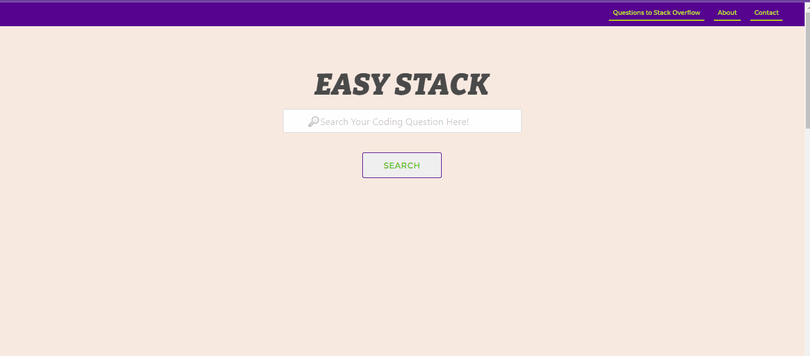

**User Friendly Stack**
=======================
The ***Easy Stack*** uses 2 API's: [Stack Exchange](https://api.stackexchange.com/)  &  [Jokes One](https://jokes.one/api/joke/) . 

(<a href="#top">back to top</a>)

## Functionality

* Website offers the ability to have cleaner interface when viewing Stack Overflow questions and responses. The website also offers the ability to submit a question to Stack Overflow if what you are looking for is not found. Lastly, incase you are too stress from trying to problem solve your coding concerns, we provide a joke to give you a chuckle!
  

(<a href="#top">back to top</a>)

* Homepage:
  *  Allows you to search through an API of Stack Overflow
  *  A navigation bar at the top of the page can redirect you to three offers. The nav bar is available on all pages:
      * a link to Stack Overflow that allows you to ask questions when you can't find your answer.
      * a link that sends you to the *About* ***Easy Stack***
      * a link that sends you to the *Contact* page that allows you to ask us questions or add comments
      * One Joke a day is also provided on the screen for your enjoyment!
  
* Search Page/Results:
    * Provides 30 possible responses to the question in an easy to use format.
    * When you click on the possible answer, it will send you to the answer location in Stack Overflow

 
(<a href="#top">back to top</a>)

## Features

* HTML
* CSS
* Bulma
* jQuery
* Server-Side API - Stack Exchange & Jokes.1

(<a href="#top">back to top</a>)

## Demo()

(<a href="#top">back to top</a>)

## Websites

* [Github](https://github.com/ModestTom/user-friendly-stack)
* [Deployed](https://modesttom.github.io/user-friendly-stack/)

(<a href="#top">back to top</a>)

## Contact

Meredith Coyne - meredithleigh.coyne@gmail.com
Thomas Spaeth - thoams.spaeth01@gmail.com
Chris Hage -  
Sheralyn Files - 

(<a href="#top">back to top</a>)

## License

The MIT License (MIT)

Copyright (c) 2021 Meredith Coyne

Permission is hereby granted, free of charge, to any person obtaining a copy of this software and associated documentation files (the "Software"), to deal in the Software without restriction, including without limitation the rights to use, copy, modify, merge, publish, distribute, sublicense, and/or sell copies of the Software, and to permit persons to whom the Software is furnished to do so, subject to the following conditions:

The above copyright notice and this permission notice shall be included in all copies or substantial portions of the Software.

THE SOFTWARE IS PROVIDED "AS IS", WITHOUT WARRANTY OF ANY KIND, EXPRESS OR IMPLIED, INCLUDING BUT NOT LIMITED TO THE WARRANTIES OF MERCHANTABILITY, FITNESS FOR A PARTICULAR PURPOSE AND NONINFRINGEMENT. IN NO EVENT SHALL THE AUTHORS OR COPYRIGHT HOLDERS BE LIABLE FOR ANY CLAIM, DAMAGES OR OTHER LIABILITY, WHETHER IN AN ACTION OF CONTRACT, TORT OR OTHERWISE, ARISING FROM, OUT OF OR IN CONNECTION WITH THE SOFTWARE OR THE USE OR OTHER DEALINGS IN THE SOFTWARE.

(<a href="#top">back to top</a>)

